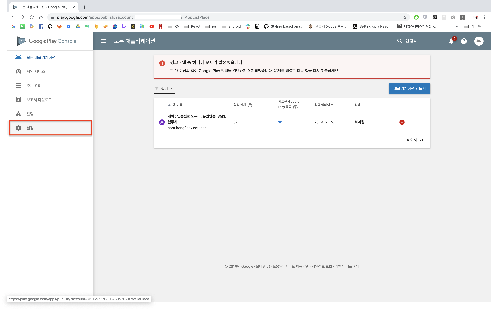
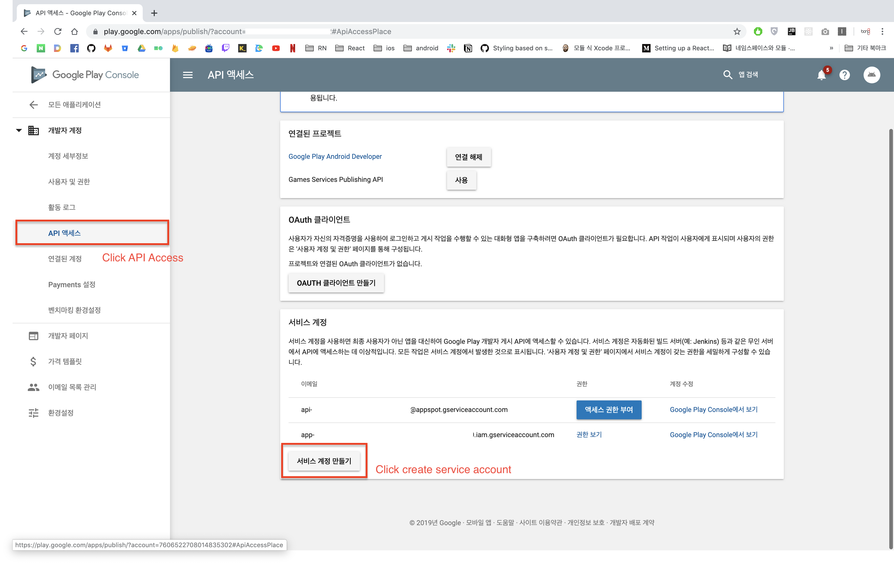
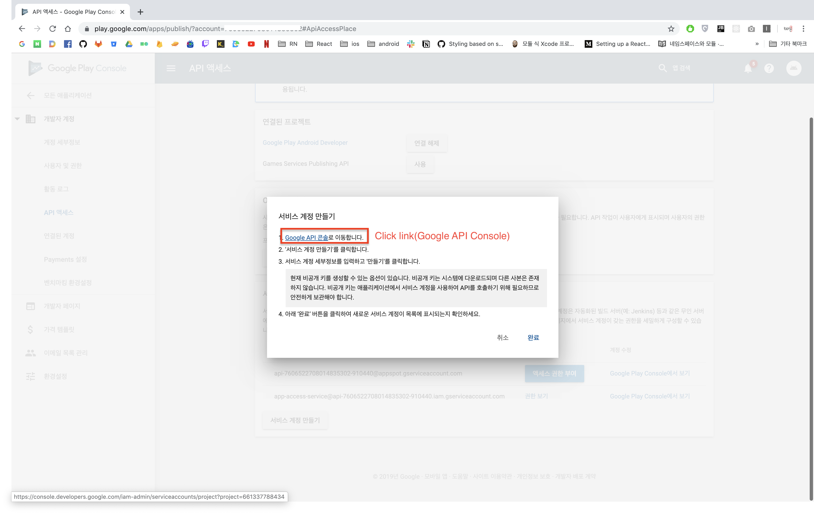
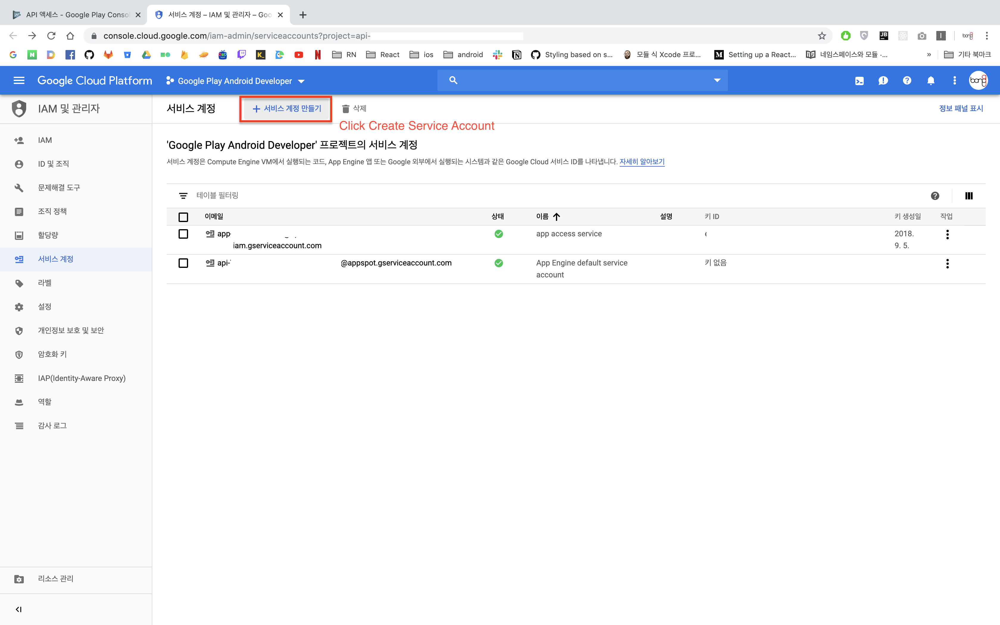
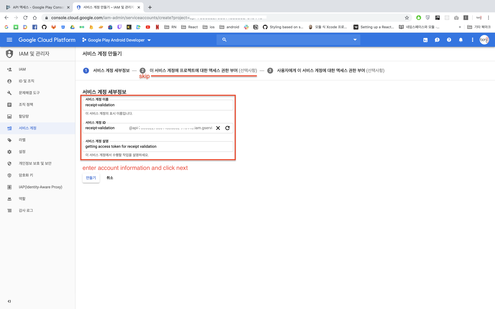
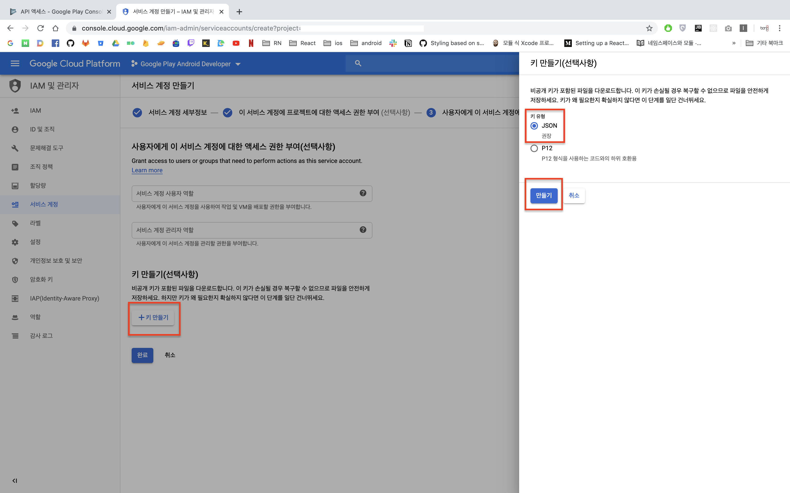
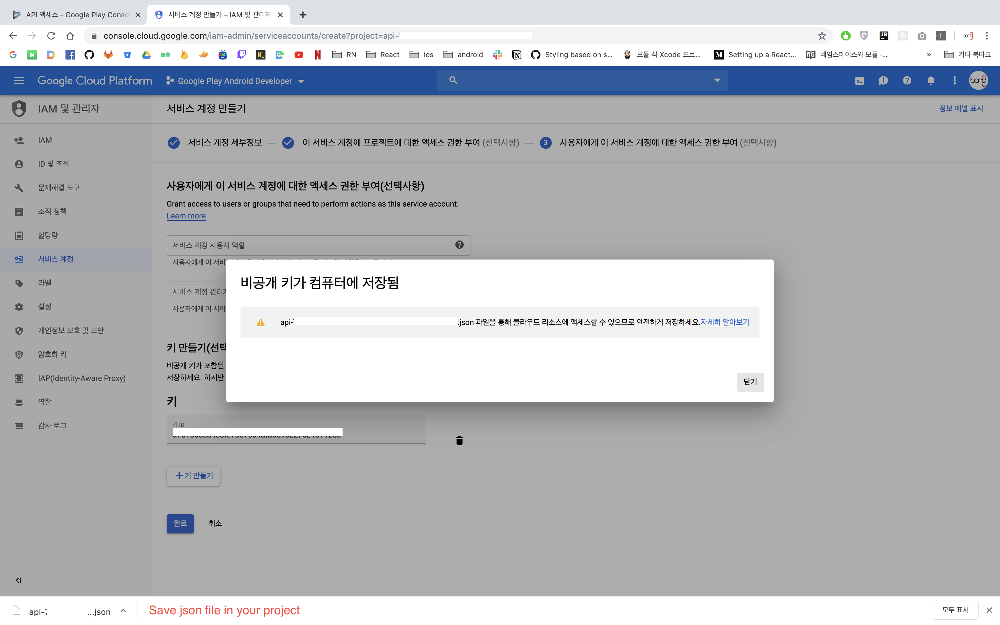
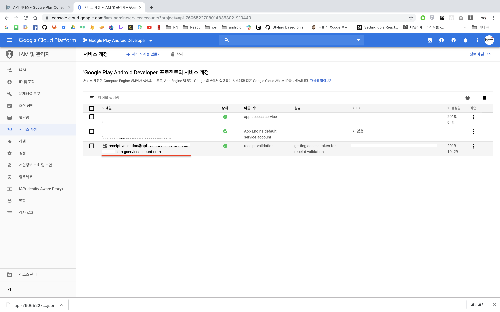
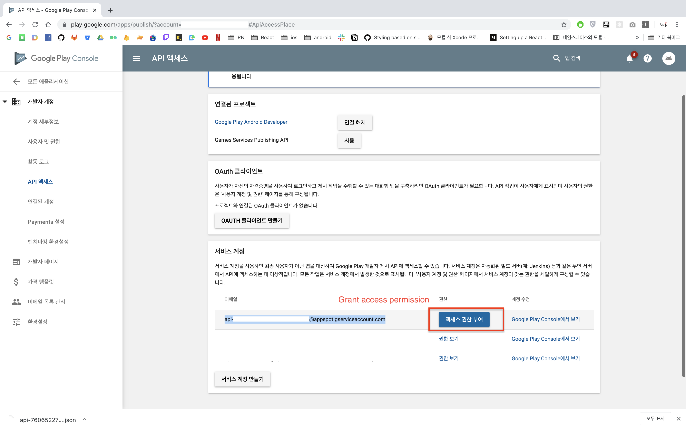
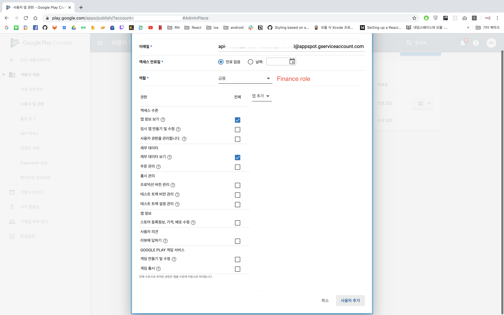

#### This repository is an example repository for getting access token needed to validate Android receipts.

- follow step 1 below
- replace `service-account.json` file to your account
- `yarn start`

- - - -

### 1. Follow this steps












### 2. Create your server
Configure your server safely, this is just for reference! not safety!

```js
const {google} = require('googleapis');
const account = require('./service-account.json');
const express = require('express');

const app = express();

const JWTClient = new google.auth.JWT(
    account.client_email,
    null,
    account.private_key,
    ["https://www.googleapis.com/auth/androidpublisher"]
);

app.get('/accessToken', (req, res) => {
    JWTClient.getAccessToken((err,token)=>{
        if(err){
            return res.status(404).send("get access token failed");
        }

        return res.status(200).send(token);
    })
});

```

### 3. Done!
